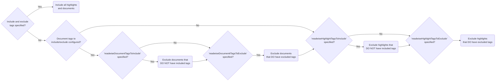

By default, this add-on will use ALL highlights from ALL documents stored in your Readwise account to generate Anki cards.

For users seeking to customize which highlights and tags are used for Anki cards generation, this-addon offers a robust filtering feature. This functionality enables you to selectively include or exclude specific highlights and documents based on their associated tags, ensuring that the content used for generating Anki cards aligns precisely with your study preferences or requirements.

There are four configuration options available for filtering highlights and documents:
1. `readwiseDocumentTagsToInclude`: A list of document tags indicating which documents (and their associated highlights) should be included.
2. `readwiseDocumentTagsToExclude`: A list of document tags indicating which documents (and their associated highlights) should be excluded.
3. `readwiseHighlightTagsToInclude`: A list of highlight tags indicating which highlights should be included.
4. `readwiseHighlightTagsToExclude`: A list of highlight tags indicating which highlights should be excluded.

The following decision tree outlines how the add-on determines which documents and highlights are used for Anki card generation, based on the above settings.

In general, inclusion of documents and highlights takes priority over exclusion. This means that if a document or tag has one or more tags specified in **both** the of the inclusion and exclusion lists, that document or tag will **not** be excluded from Anki card generation.

## An Example to Illustrate the Above