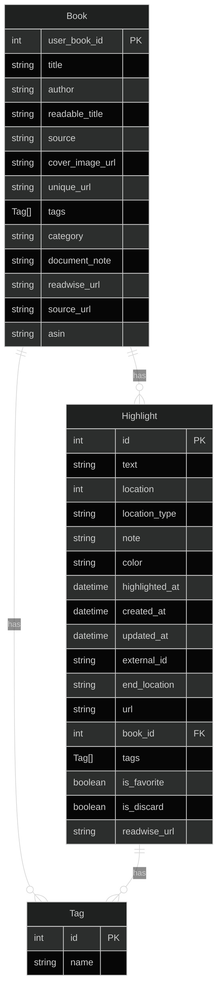

```mermaid
%%{init: {'theme': 'dark' } }%%
erDiagram
    Book {
        int user_book_id PK
        string title
        string author
        string readable_title
        string source
        string cover_image_url
        string unique_url
        Tag[] tags
        string category
        string document_note
        string readwise_url
        string source_url
        string asin
    }
    Highlight {
        int id PK
        string text
        int location
        string location_type
        string note
        string color
        datetime highlighted_at
        datetime created_at
        datetime updated_at
        string external_id
        string end_location
        string url
        int book_id FK
        Tag[] tags
        boolean is_favorite
        boolean is_discard
        string readwise_url
    }
    Tag {
        int id PK
        string name
    }
	Book ||--o{ Highlight : "has"
	Book ||--o{ Tag : "has"
	Highlight ||--o{ Tag : "has"
```