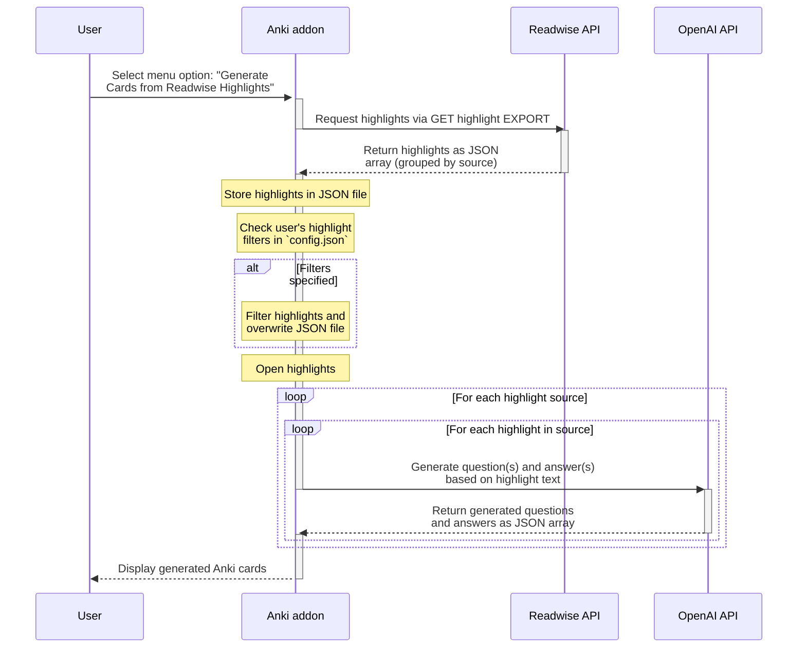

```mermaid
sequenceDiagram
    participant User
    participant AnkiAddon as Anki addon
    participant ReadwiseAPI as Readwise API
    participant OpenAIAPI as OpenAI API

    User ->>+ AnkiAddon: Select menu option: "Generate<br>Cards from Readwise Highlights"
    activate AnkiAddon
    AnkiAddon ->>- ReadwiseAPI: Request highlights via GET highlight EXPORT
    activate ReadwiseAPI
    ReadwiseAPI -->> AnkiAddon: Return highlights as JSON<br>array (grouped by source)
    deactivate ReadwiseAPI
    activate AnkiAddon
    Note over AnkiAddon: Store highlights in JSON file
    Note over AnkiAddon: Check user's highlight<br>filters in `config.json`
    alt Filters specified
        Note over AnkiAddon: Filter highlights and<br>overwrite JSON file
    end
    Note over AnkiAddon: Open highlights 
    loop For each highlight source
        loop For each highlight in source
            AnkiAddon ->>+ OpenAIAPI: Generate question(s) and answer(s)<br>based on highlight text
            deactivate AnkiAddon
            OpenAIAPI -->>- AnkiAddon: Return generated questions<br>and answers as JSON array
            Activate AnkiAddon
        end
    end
    AnkiAddon -->>- User: Display generated Anki cards

```